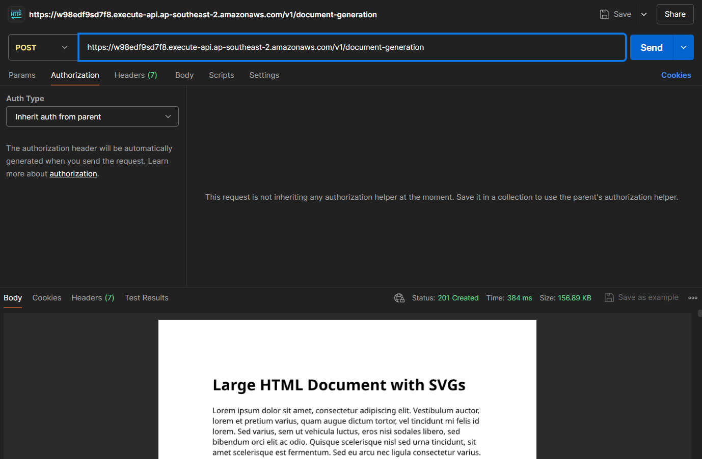
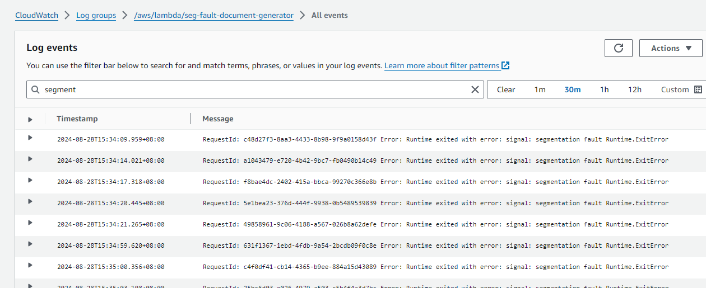

# IronPdf AWS Lambda Segementation Fault Reproduction

## Problem Description
This is a AWS CDK project with the aim to help reproduce an IronPDF generation error that only intermittently occurs.
The error message we get is `Error: Runtime exited with error: signal: segmentation fault Runtime.ExitError`

## Context

We are running IronPdf in AWS Lambda inside a custom built AWS container Linux image. We have been following the recommendations from IronPdf and AWS for the setup.
See `./src/functions/DocumentGeneration.Lambdas/Dockerfile` for specifics.
We are experiencing this issue only since we have upgraded to .net 8.0 (from 6.0) and the recommended AWS Lambda runtime.
We are using the latest versions of .net, Lambda as well as IronPdf.

## Setup and deployment

1. Make sure you have node installed (e.g. `v18.5.0`)
1. Make sure you the aws cli installed.
1. Make sure you have Docker installed and running
1. Run `npm i`
1. Authenticate against an AWS account (e.g. `aws sso login`)
1. (Optional: to verify aws account setup) Run `npm run build` to run the CDK build against your account to see if you can reach AWS and build the cloud formation tempmlate
1. Run `npm run deploy` to deploy the stack to AWS, which will build the docker image and create all the resources
1. After deployment succeeded, you will get back the API url. Make note of this
1. Copy the API url into the test file `./load-test/boom.ts`, e.g. `const targetUrl = 'https://a6sd5fa6ds.execute-api.ap-southeast-2.amazonaws.com/v1/';`
1. Configure a valid Iron PDF key in the AWS Secrets Manager for the secret `SegFault.IronPdf.License.LicenseKey`.
1. You should now be ready to run post requests against your API to generate a pdf document, e.g. against `https://a6sd5fa6ds.execute-api.ap-southeast-2.amazonaws.com/v1/document-generation`
1. See below load test which will fire concurrent requests against the Lambda to provoke the segmentation fault eventually.

## Getting a single document via postman

You can use postman to get the sample pdf which this repo generates once deployed.

Use your url from above, e.g. `https://a6sd5fa6ds.execute-api.ap-southeast-2.amazonaws.com/v1/document-generation`



## Reproduction of the intermittent issue

Run the crude load tests by executing `npx tsx ./load-test/boom.ts` from the console root.

Currently configured in the load tests are blocks of 50 * 10 concurrent requests.

After running this a few times, we could usually reproduce the segmentation fault at least a few times. See your cloudwatch logs for details.



## Adding custom GC.Collect
Adding a custom ```GC.Collect();``` seems to fix the issue. However, it is not best practise to have to execute this manually.
For more info and context, see: https://help.ironsoftware.com/tickets-view/details?back=tickets&ticketId=3158021300

Instead, one day, we should be able to use a `using` statement with the ChromePdfRenderer, and the clean up of any unused objects should be implemented using the `Dispose` pattern on the IronPdf side.

## Enabled Debug Logging

To get more verbose logging, enable Debug log in the `./src/infra/constructs/functions` file:
`this.documentGenerator.addEnvironment('POWERTOOLS_LOG_LEVEL', 'Debug');`
> **Warning**: This might rack up costs for CloudWatch in AWS if you fire loads of requests with the Debug flag on, since the amount of data is quite extensive.
